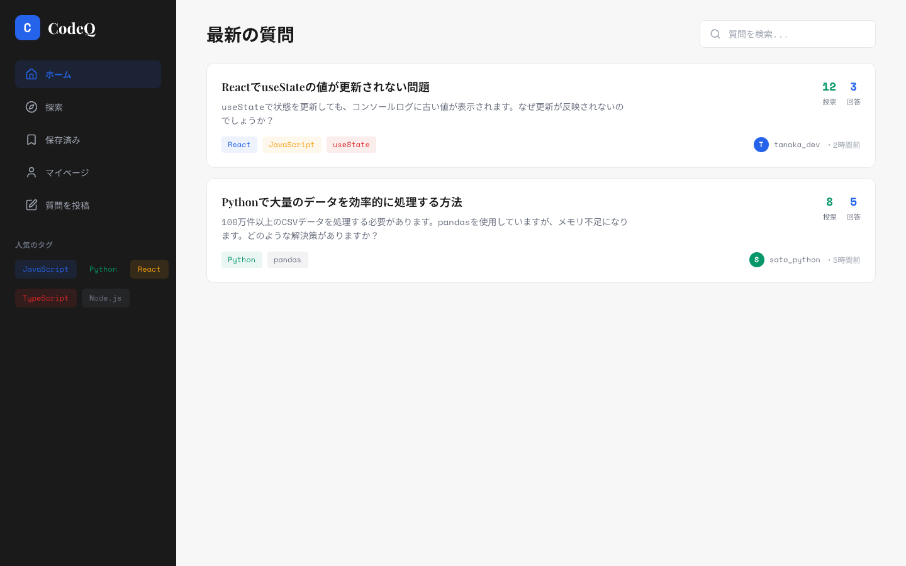
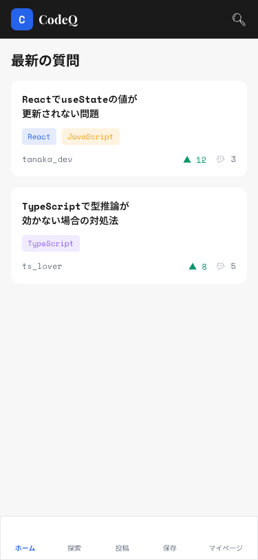
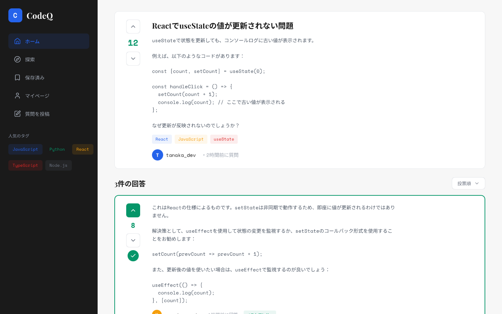
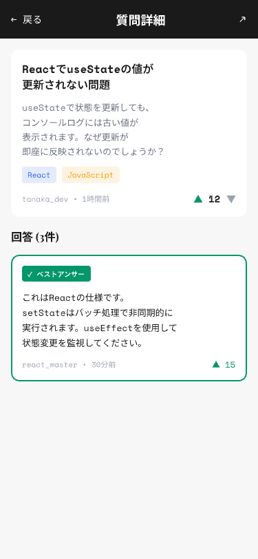
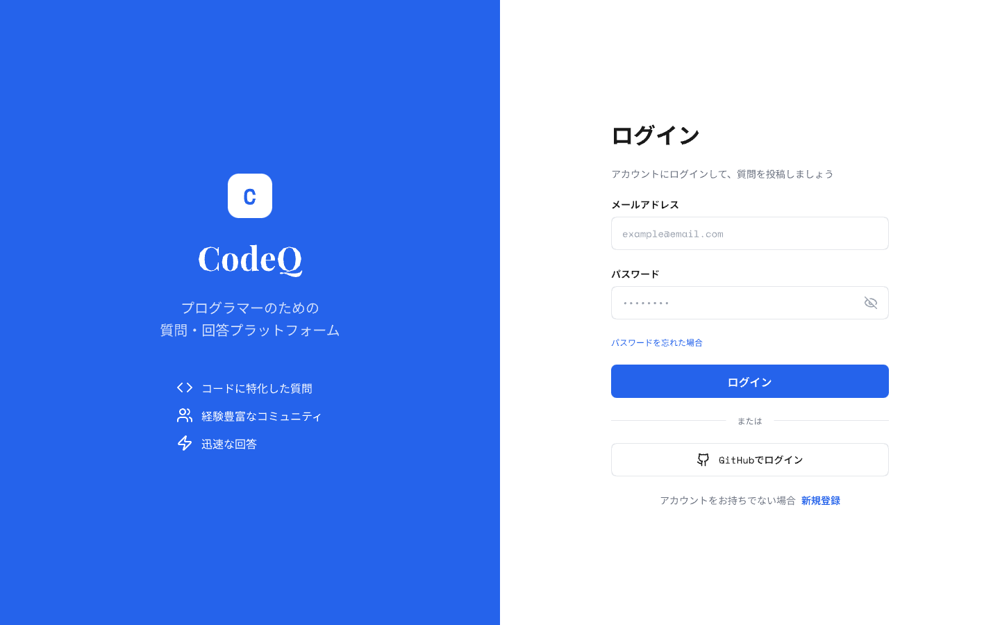
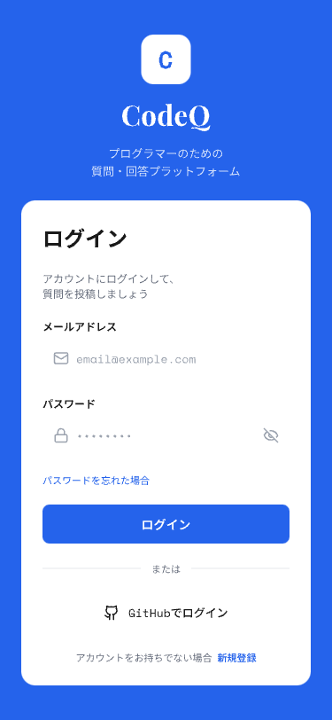
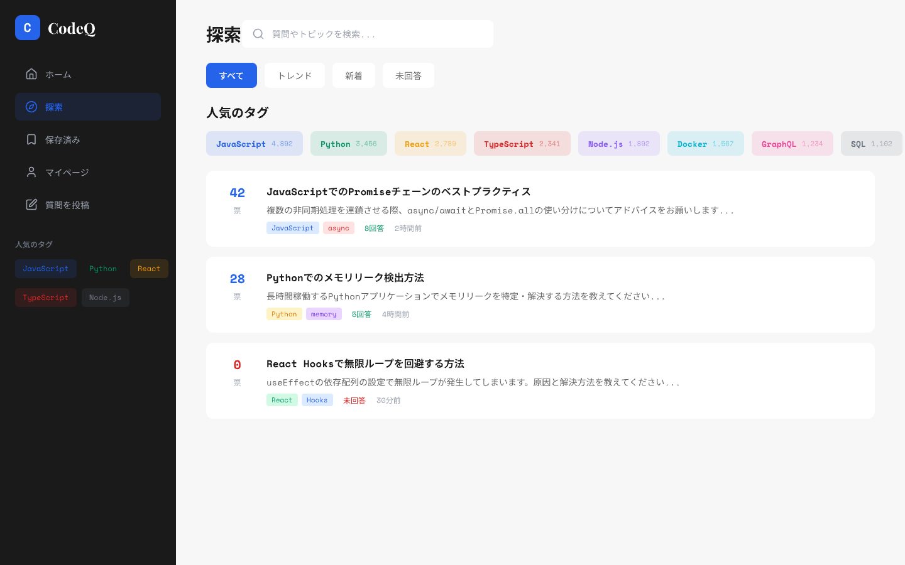
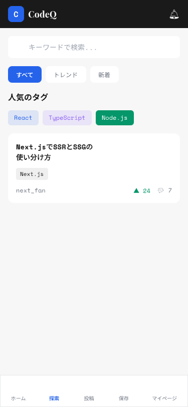

# CodeQ

プログラミング学習者のためのQ&Aプラットフォームです。Stack Overflowライクなインターフェースで、プログラミングに関する質問・回答を投稿・共有できます。

## 📌 概要

CodeQは、プログラミング初学者から中級者を対象としたQ&Aウェブアプリケーションです。日本語でプログラミングに関する疑問を気軽に質問でき、コミュニティからの回答を得ることができます。

### 開発の背景

- 英語ベースのQ&Aサイト（Stack Overflow等）は情報量が豊富だが、初学者にはハードルが高い
- 日本語で気軽に質問・回答できる、シンプルで使いやすいプラットフォームが必要
- モダンな技術スタック（Next.js App Router、Supabase認証）を使った実践的な開発経験を積む

### 公開URL

🔗 **[CodeQ](https://codeq.vercel.app)** 

---

## ✨ 特徴と機能の説明

### 1. 質問一覧ページ（ホーム）

<table>
  <tr>
    <td></td>
    <td></td>
  </tr>
  <tr>
    <td align="center">PC版</td>
    <td align="center">モバイル版</td>
  </tr>
</table>

- 最新の質問がカード形式で一覧表示されます
- 各質問には投票数、回答数、閲覧数が表示され、活発な議論が一目でわかります
- タグによるカテゴリ分けで、関連する技術領域を視覚的に把握できます
- **回答が採用された質問**は緑色でハイライト表示

### 2. 質問詳細・回答ページ

<table>
  <tr>
    <td></td>
    <td></td>
  </tr>
  <tr>
    <td align="center">PC版</td>
    <td align="center">モバイル版</td>
  </tr>
</table>

- 質問の詳細内容と回答一覧を表示
- **投票機能**: 質問・回答に対してUpvote/Downvoteが可能
- **ベストアンサー機能**: 質問者は最も役立った回答を採用できます
- **保存機能**: 気になる質問をブックマークして後で確認可能
- **回答投稿**: ログインユーザーは回答を投稿できます

### 3. 認証機能（ログイン・新規登録）

<table>
  <tr>
    <td></td>
    <td></td>
  </tr>
  <tr>
    <td align="center">PC版</td>
    <td align="center">モバイル版</td>
  </tr>
</table>

- **メール/パスワード認証**: 従来型のアカウント登録・ログイン
- **GitHub OAuth**: GitHubアカウントでワンクリックログイン
- Supabase Authを活用したセキュアな認証基盤
- レスポンシブ対応のモダンなUIデザイン

### 4. 探索ページ

<table>
  <tr>
    <td></td>
    <td></td>
  </tr>
  <tr>
    <td align="center">PC版</td>
    <td align="center">モバイル版</td>
  </tr>
</table>

- 人気のタグやトレンドの質問を探索できます
- タグ別に質問をフィルタリング可能

### 5. その他の機能

- **質問投稿**: タイトル、本文、タグを指定して質問を投稿
- **マイページ**: 自分が投稿した質問・回答の一覧
- **保存した質問**: ブックマークした質問の一覧
- **レスポンシブデザイン**: PC・タブレット・スマートフォンに対応

---

## 🛠 使用技術（技術スタック）

### フロントエンド

| 技術 | バージョン | 用途 |
|------|-----------|------|
| **TypeScript** | 5.x | 型安全な開発 |
| **React** | 19.x | UIライブラリ |
| **Next.js** | 16.x (App Router) | フルスタックフレームワーク |
| **Tailwind CSS** | 4.x | スタイリング |
| **Lucide React** | 0.563.x | アイコン |

### バックエンド

| 技術 | 用途 |
|------|------|
| **Next.js API Routes** | REST APIエンドポイント |
| **Prisma** | ORMによるデータベースアクセス |
| **Supabase Auth** | 認証・認可 |

### インフラ・サービス

| サービス | 用途 |
|----------|------|
| **Supabase** | PostgreSQLデータベース、認証 |
| **Vercel** | ホスティング・デプロイ |
| **GitHub** | ソースコード管理、OAuth |

### 開発ツール

| ツール | 用途 |
|--------|------|
| **VS Code** | エディタ |
| **ESLint** | コード品質管理 |
| **Prisma Studio** | データベース管理GUI |
| **Pencil** | ワイヤーフレーム作成 |

### システム構成図

```
┌─────────────────────────────────────────────────────────────────┐
│                          Vercel                                 │
│  ┌─────────────────────────────────────────────────────────┐    │
│  │                    Next.js App                          │    │
│  │  ┌─────────────┐  ┌─────────────┐  ┌─────────────────┐  │    │
│  │  │   Pages     │  │  API Routes │  │   Middleware    │  │    │
│  │  │  (React)    │  │   (REST)    │  │  (Auth Check)   │  │    │
│  │  └─────────────┘  └──────┬──────┘  └─────────────────┘  │    │
│  └──────────────────────────┼──────────────────────────────┘    │
└─────────────────────────────┼───────────────────────────────────┘
                              │
              ┌───────────────┼───────────────┐
              │               │               │
              ▼               ▼               ▼
      ┌───────────────┐ ┌───────────┐ ┌─────────────────┐
      │   Supabase    │ │  Prisma   │ │     GitHub      │
      │  PostgreSQL   │ │   ORM     │ │     OAuth       │
      └───────────────┘ └───────────┘ └─────────────────┘
```

---

## 📅 開発期間・体制

- **開発体制**: 個人開発
- **開発期間**: 2026年2月（約1週間）

---

## 💡 工夫した点・苦労した点

### 工夫した点

1. **Next.js App Routerの活用**
   - Server Componentsを活用し、初期ロードパフォーマンスを最適化
   - 認証状態に応じたルート保護をMiddlewareで実装

2. **Supabase Auth + Prismaの統合**
   - Supabaseの認証とPrismaのデータ管理をスムーズに連携
   - ユーザー情報の同期処理を自動化

3. **直感的なUI/UX**
   - 投票数やタグを視覚的にわかりやすく表示
   - モバイルファーストのレスポンシブデザイン

### 苦労した点

1. **認証フローの実装**
   - Supabase Auth SSRとNext.js App Routerの組み合わせで、セッション管理に試行錯誤

2. **投票機能の状態管理**
   - ユーザーごとの投票状態の取得・更新を効率的に実装

---

## 🚀 既知の課題と今後の展望

### 既知の課題

- [ ] マークダウン記法への対応（コードハイライト等）
- [ ] コメント機能の実装
- [ ] 検索機能の強化

### 今後の展望

- [ ] リアルタイム通知機能（回答が付いた時など）
- [ ] ユーザーのレピュテーションシステム
- [ ] AI による質問の自動タグ付け
- [ ] 多言語対応

## 📬 連絡先

- **GitHub**: https://github.com/pinattutaro
- **Email**: pinattutaro@gmail.com